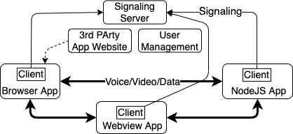

# Brume Client API

Brume provides user-to-user, AKA peer-to-peer (P2p), data/voice/video communication between Brume users. A Brume client uses the Brume signaling server to establish the P2P communication channel with some other Brume client. At that point, communication is directly between user devices without traversing a central server. A Brume client can run in [NodeJS](https://nodejs.org), browser and [webview-nodejs](https://github.com/Winterreisender/webview-nodejs). This repo provides a common API that a Brume client can use in any of these environments.

[Brume System Overview](#architecture)</br>
[Brume API](#api)</br>
[Peer instance](#peer)</br>
[Installation](#using)</br>
[Writing a Brume client](#brumeclient)</br>
[License](#license)

# Brume System Overview <a name="architecture"></a>



From a user's perspective the Brume system is a user account and Brume applications. A user account is created using the [management system](https://brume.occams.solutions). New users get a free trial with 1,000 connection attempts that are valid for one year. Additional connetion attempts can be purchased.

Brume applications use the Brume client to first establish a signaling connections to the server, then establish a peer-to-peer connection to another application using that application's Brume user name. Each attempt by a Brume user to connect to another user is a <i>connection attempt</i>.

# Brume API <a name="api"></a>

## Constructor

```
import { Brume } from 'brume-client-api';
const brume = new Brume( { [ wrtc, WebSocket ], [ trickle ] } );
```
Create a Brume client API instance.

**wrtc**\<Object\> - WebRTC. Required in NodeJS</br>
**WebSocket**\<Object\> - WebSocket. Required in NodeJS</br>
**trickle = true**\<Boolean\> - Use trickle ICE</br>
*returns*\<Object\> - Brume client API instance

## Methods

### brume.start( { token, url } )

Connect to the Brume signaling server.

**token**\<string\> - Brume identification JWT</br>
**url**\<string\> - Brume server URL</br>
*returns*\<Promise\> - resolves to the Brume instance or rejected with error

**token** is acquired either by logging into the Brume server with a user's email and password (see [brume-web](https://github.com/boblund/brume-web)) or by downloading a config file containing the token from the [Brume website](https://brume.occams.solutions).

This method must be called before a peer connection can be made or received.

```
try {
	await brume.start( { token, url } );
} catch( e ){
	//process error
}
```
### peer = await brume.connect( brumeName )

Get the peerconnection (with data channel) to the Brume user identified by brumeName.

**brumeName**\<string\> - Brume identification JWT</br>
*returns*\<Promise\> - resolves to the existing peerconnection if present otherwise creates a new one. or rejected with an error:
<table style="margin-left: 2em;">
	<tr><td>'ENODEST'</td><td>brumeName is not connected to the Brume signaling server.</td></tr>
	<tr><td>'EBADDEST'</td><td>brumeName is not a Brume name.</td></tr>
	<tr><td>'EOFFERTIMEOUT'</td><td>The attempt to connect to brumeName timed out.</td></tr>
	<tr><td>'ENOSRV'</td><td>Cannot create new peer because no signalling server connection.</td></tr>
	<tr><td>'ESERVER'</td><td>An unspecified Brume signaling server error.</td></tr>
</table>


```
try {
	const peer = await brume.connect( 'alice' );
	...
} catch( e ){
	//process error code e
}
```

### brume.thisUser

Brume name of this Brume instance.

*returns*\<string\> - Brume user name

```
myBrumeName = brume.thisUser;
```

### brume.onconnection = handler

Register a function **handler** to be called when a peer connection request is received.

**handler**\<Function\> - Called with parameter **{ peer, accept }** where **peer** is a simple-peer instance and **accept** is an async function that is called to accept the offered connection, allowing the connection receiver to set up the peer instance before the WebRTC data channel is established.

```
function offerHandler( peer, accept ){
	// set up peer.on handlers
	await accept();
	// peer-to-peer data channel established
};

brume.onconnection( offerHandler );
```

### brume.stop()

Disconnect from the Brume signaling server.

```
brume.stop();
```

### Brume.encodeMsg( { type, data } )

Create a Uint8Array encoded message of **type** containing **data**.

**type**\<string\> - Identifies the format of **data**.</br>
**data**\<Object\> - Message data. **type** === 'chunk' means **data** is a Uint8Array.</br>
*returns* - instance of Uint8Array

```
peer.send( Brume.encodeMsg( { type: 'action', data} ) );
```

### Brume.decodeMsg( msg );

Decode an encoded msg.

**msg**\<Uint8Array\> - message encoded with Brume.encodeMsg()</br>
*returns*\<Object\> - { **type**, **data** } where **type** is a \<string\> identifying the format of **data**

```
const { type, data } = Brume.decodeMsg( msg );
```

## Events

### brume.on( 'serverclose' )

Received when the Brume server closes the connection to this Brume instance.

### brume.on( 'reauthorize', config )

Received if the token used in brume.start( ... ) has expired and a refresh token was used to generate a new token. ```config``` is a new config object with a new token. A refresh token is only available i the config file downloaded from the [Brume website](https://brume.occams.solutions).

# Peer Instance <a name="peer"></a>

Brume creates an instance of the [simple-peer](https://github.com/feross/simple-peer) Peer class when a connection request is made or received. Brume extends simple-peer in several ways.

## Peer connection creation

As noted, the peer instance created by Brume is already connected to the other peer and a data channel is configured. The offer/answer/candidate signaling has already been done by Brume.

An application can have multiple peer connections, each to a different Brume name.

## Media streams

All media streams are created dynamically, there is no option to do so when the peer is created. A Brume peer creates a media stream by:

```
function addMedia (stream) {
  peer1.addStream(stream) // <- add streams to peer dynamically
}

// then, anytime later...
navigator.mediaDevices.getUserMedia({
  video: true,
  audio: true
}).then(addMedia).catch(() => {})
```

A Brume peer receives notification of a stream by:

```
peer2.on('stream', stream => {
  // got remote video stream, now let's show it in a video tag
  var video = document.querySelector('video')

  if ('srcObject' in video) {
    video.srcObject = stream
  } else {
    video.src = window.URL.createObjectURL(stream) // for older browsers
  }

  video.play()
})
```
<span style="font-size:0.6em">Taken from [simple-peer dynamic streams](https://github.com/feross/simple-peer?tab=readme-ov-file#dynamic-videovoice)</span>

Brume handles all of the signaling generated by the above; the peers needn't and shouldn't use the simple-peer signal method or listen for 'signal' events.

## Data channel multiplexing

Brume defines a simple data channel protocol. Each message is an object ```{ type, data }``` where ```type``` is a string and ```data``` can be either a string or a Uint8Array. The message is sent as a Uint8Array. The Brume class static methods ```encode( ... )``` and ```decode( ... )``` are used by the sender and receiver.

## Dynamic media signaling over the data channel

Brume bypasses the signaling server and sends all signaling messages generated by dynamic media streams over the peer-to-peer data channel once it is created; the signaling server is no longer needed.

## Constructor

Peer instances are created in Brume; there is no publicly available Peer constructor.

## Methods

## peer.peerUsername

Contains the Brume ID of the far peer.

## peer.send and peer.write

An application must use **Brume.encodeMsg** and **Brume.decodeMsg** to take advantage of data channel multiplexing. This is not required.

## Events

## close and data

The Brume instance acts on these events to manage the peers it creates and for multiplexing signaling on the data channel. The events are then passed on to the application listeners. Brume will not work if the application calls **peerInstance.removeAllListeners( 'close' | 'data' )**.

# Using <a name="using"></a>

The API can be used by installing the repo or installing it as a dependency.

## Install the repo

```
git clone git@github.com:boblund/brume-client.git
cd brume-client
```

## Install as a depdendency

```
npm i --install-strategy=nested github:boblund/brume-client-api
```

<strong>NOTE:</strong> The package needs to install with its depedency node_modules not being hoisted, hence the ```--install-strategy=nested```.

# Writing a Brume client <a name="brumeclient"></a>

The [brume-client](https://www.github.com/boblund/brume-client) Github repository contains examples of writing a Brume client application in NodeJS, a browser and Webview.

# License <a name="license"></a>

Creative Commons Attribution-NonCommercial 4.0 International

THIS SOFTWARE COMES WITHOUT ANY WARRANTY, TO THE EXTENT PERMITTED BY APPLICABLE LAW.
